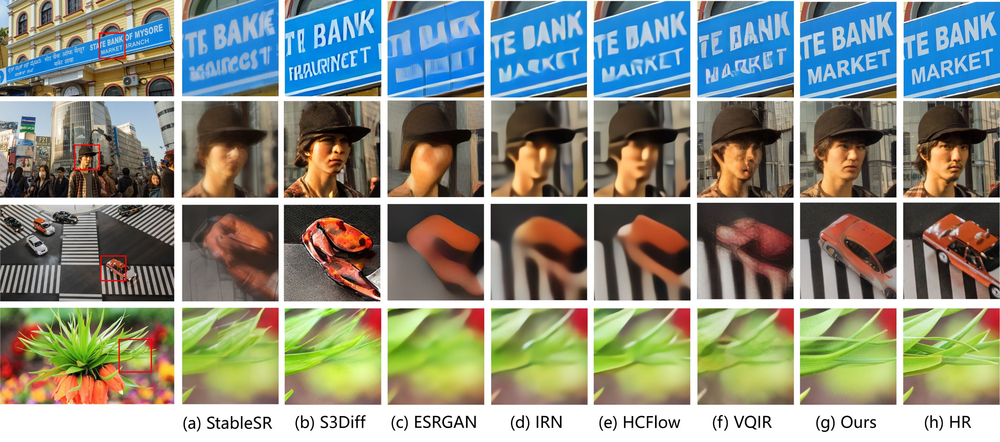
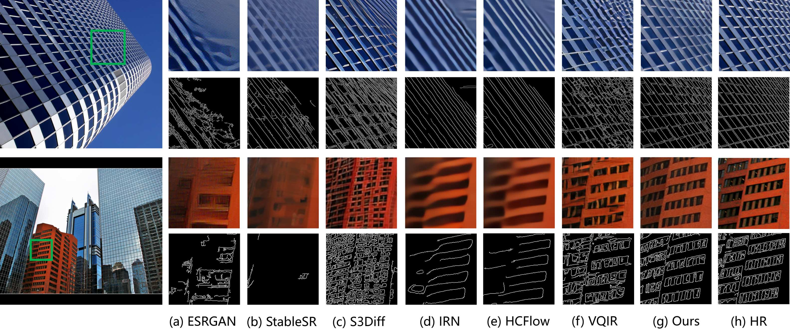
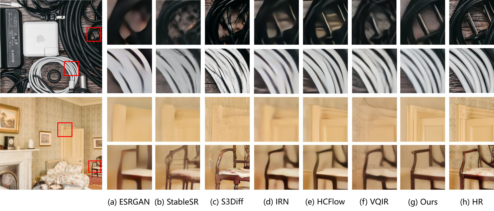

<h2 align="center">[ICCV 2025] Timestep-Aware Diffusion Model for Extreme Image Rescaling</h2>

<div align="center">

<a href="https://arxiv.org/abs/2408.09151"></a>       

[Ce Wang]()<sup>1</sup>, [Zhenyu Hu]()<sup>1</sup>, [Zhenzhong Chen]()<sup>1</sup>, [Wanjie Sun]()<sup>1</sup> <sup>1</sup>School of Remote Sensing and Information Engineering, Wuhan University

</div>

<p align="center">
    
</p>

---

## 📚 Table of Contents

* [Visual Results](#visual_results)
* [Installation](#installation)
* [Pretrained Models](#pretrained_models)
* [Dataset](#dataset)
* [Inference](#inference)
* [Training](#training)
* [Citation](#citation)
* [Acknowledgements](#acknowledgements)
* [Contact](#contact)

---

## <a name="visual_results"></a>👁️ Visual Results

### Results on DIV2K and CLIC2020



### Results on Urban100



### Results on DIV8K



---

## <a name="installation"></a>⚙️ Installation

```bash
# Clone this repository
git clone https://github.com/wwangcece/SGDM.git

# Create a conda environment with Python >= 3.9
conda create -n TADM python=3.9
conda activate TADM

# Install required packages
pip install -r requirements.txt
```

---

## <a name="pretrained_models"></a>🧬 Pretrained Models

Download the pretrained models from the link below and place them in the `checkpoints/` directory:

[Download from Google Drive](https://drive.google.com/drive/folders/1dte0A55F6YhBRagbPl2FDEv-Ku-wSSW1?usp=drive_link)

---

## <a name="dataset"></a>📊 Dataset

1. Refer to the [BasicSR dataset preparation guide](https://github.com/XPixelGroup/BasicSR/blob/master/docs/DatasetPreparation.md#Common-Image-SR-Datasets) to prepare high-resolution datasets.
2. Use the script `src/get_z.py` to encode high-resolution images into latent features and save them as `.npy` files.

---

## <a name="inference"></a>⚔️ Inference

1. Modify the validation dataset configuration in `configs/tadm_test.yaml` and update the pretrained model path in `run_inference.sh`.
2. Run the inference script:

```bash
sh run_inference.sh
```

---

## <a name="training"></a>🌟 Training

1. Modify the training dataset configuration in `configs/tadm_train.yaml` and update settings in `run_training_dfrm.sh`.
2. Train the feature rescaling module:

```bash
sh run_training_dfrm.sh
```

3. Then modify `run_training_tadm.sh` as needed and train the TADM model:

```bash
sh run_training_tadm.sh
```

---

## <a name="citation"></a>📖 Citation

If you find this work helpful, please consider citing:

```bibtex
@misc{wang2025timestepawarediffusionmodelextreme,
  title={Timestep-Aware Diffusion Model for Extreme Image Rescaling},
  author={Ce Wang and Zhenyu Hu and Wanjie Sun and Zhenzhong Chen},
  year={2025},
  eprint={2408.09151},
  archivePrefix={arXiv},
  primaryClass={cs.CV},
  url={https://arxiv.org/abs/2408.09151}
}
```

---

## <a name="acknowledgements"></a>🙏 Acknowledgements

This project is based on [S3Diff](https://github.com/ArcticHare105/S3Diff). We thank the authors for their excellent work.

---

## <a name="contact"></a>📨 Contact

If you have any questions, feel free to reach out to:
**Ce Wang** — [cewang@whu.edu.cn](mailto:cewang@whu.edu.cn)
